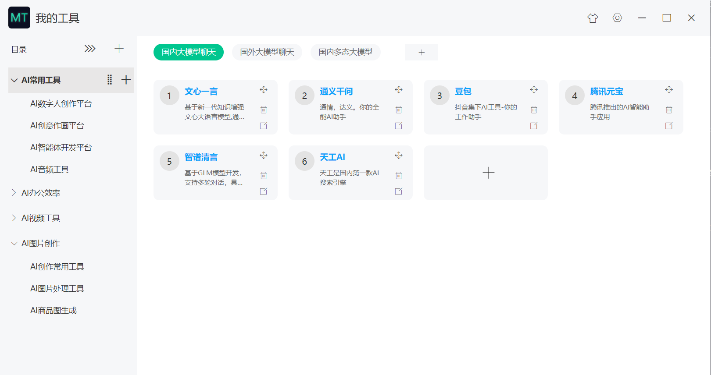

# my-tools(MT)  我的工具 

本项目是我的工具的官网

**我的分类我做主的分类工具**

[我的工具(MT)](https://github.com/msyuan/my-tools)，是一个本地桌面客户端分类工具，可以自主定义和管理您的工具网址分类。

个人博客： [前端吧 - http://www.qianduan8.com/](http://www.qianduan8.com/) 

## 下载安装

去官网下载直接安装即可

[我的工具官网](http://www.qianduan8.com/?_blank)

## 使用说明

#### 左侧-菜单管理

* 点击对应的 + 号可以添加新的一级目录和二级菜单
* 右键菜单可以删除菜单、重命名菜单等功能
* 右键二级菜单可以移动到其他目录
* 拖拽一级目录即可完成同级排序
* 拖拽二级菜单即可完成同级排序

### 右侧-导航分类

* 右键导航分类可以删除分类、重命名分类
* 点击 + 号按钮添加分类

### 右侧-网址列表

* 点击 + 号按钮添加网址
* 点击对应的图标可以删除、编辑网址
* 拖拽右上角图标可以完成同级网址排序
* 右键网址描述的地方，出现右键菜单可以移动到其他分类

### 主题设置

* 主题：可以设置主题风格

### 设置

* 设置里可以查看数据存储的位置，方便数据迁移时使用
* 设置里可以手动备份数据

## 为什么要开发一款本地桌面客户端的分类工具？

由于自己也有自己的博客导航网站，用的开源框架搭建的，在用的过程中发现管理分类很不方便，后来在语雀上用创建文档的方式，来记录自己常用工具，开源项目、技术资料、资源等等，文档记录确实也是方便，但还不是自己最终最想要的那个模式，而且自己也想实践electron一番，不知道开发点什么？要不就开发一款数据本地化的桌面客户端分类工具试试，于是乎都开发出这个小工具了，可以方便自主定义和管理这些网址分类。

### 那为什么不用收藏夹或者浏览器TAB插件呢？

首先收藏夹管理更不方便，这不是自己想要的，包括浏览器的那些TAB插件，花里胡哨的，也不方便，不如自己整一个本地客户端分类工具。
