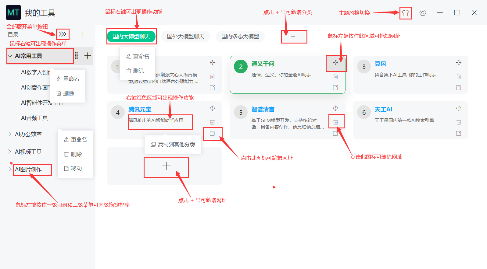

# 帮助中心

## 一、使用说明示意图

## 一、我的数据保存在哪里？数据可以备份吗？

所有菜单数据均存储在您自己的电脑（在设置管理-设置里面查看），每个人都可以编辑属于自己的分类和网址，您编辑的数据属于您个人的，都存储在您自己的电脑里。

我的工具提供有数据备份的功能，每天只能保存一份当前最新的数据，因为当天上次备份的数据会被当天下次备份的数据覆盖，所以每天只能保存一份当前最新的数据。（在设置管理-设置查看）

## 二、我的数据要如何迁移？比如旧电脑的数据迁移到其他新电脑

可以找到数据目录(在设置管理-设置里面)，把useData下的所有文件，拷贝覆盖到新安装《我的工具》useData目录下即可，这样就会覆盖掉初始化默认的数据了，新安装的《我的工具》就具备旧电脑的数据了。此后您就可以在此编辑属于自己的数据了。

## 三、为什么不提供保存数据在线上的功能？

第一：我的工具不保存任何人的数据在服务器上，只提供默认的初始化数据，我的工具也只提供数据管理和相关操作的功能。

第二：我的工具不提供保存数据在线上的功能，因为每个人的数据都是自己的，自己负责管理自己的数据，保存在自己的电脑硬盘。

第三：我的工具是帮助用户快速搭建自己分类的工具，帮助用户管理自己工具的一个分类工具，我的分类我做主。

## 四、为什么要开发一款本地桌面客户端的分类工具？

由于自己也有自己的博客导航网站，用的开源框架搭建的，在用的过程中发现管理分类很不方便，后来在语雀上用创建文档的方式，来记录自己常用工具，开源项目、技术资料、资源等等，文档记录确实也是方便，但还不是自己最终最想要的那个模式，而且自己也想实践electron一番，不知道开发点什么？要不就开发一款数据本地化的桌面客户端分类工具试试，于是乎都开发出这个小工具了，可以方便自主定义和管理这些网址分类。

## 五、那为什么不用收藏夹或者浏览器TAB插件呢？

首先收藏夹管理更不方便，这不是自己想要的，包括浏览器的那些TAB插件，花里胡哨的，也不方便，不如自己整一个本地客户端分类工具。