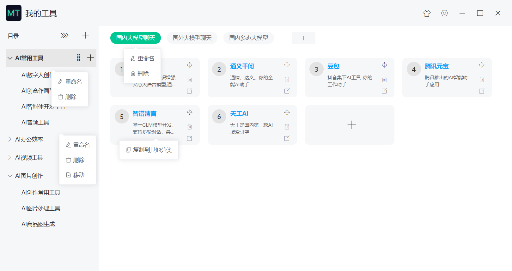
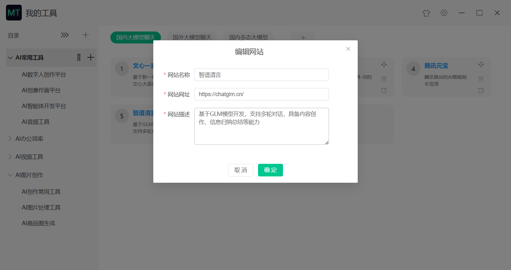
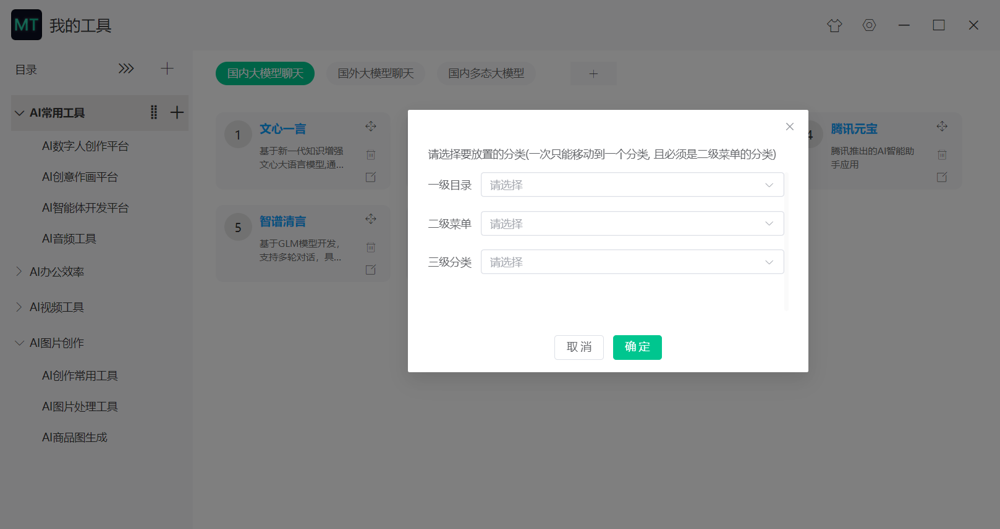
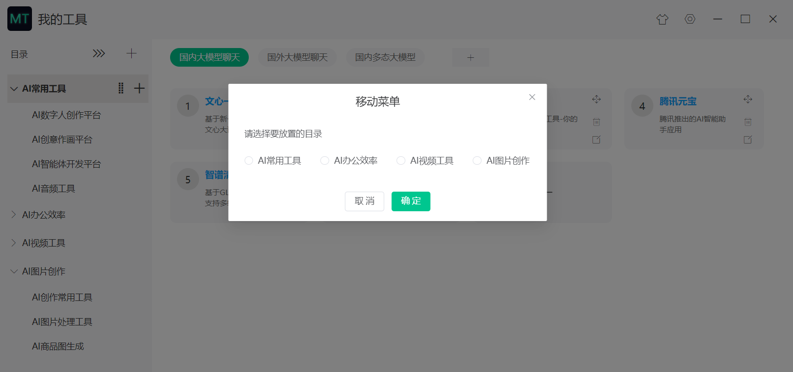
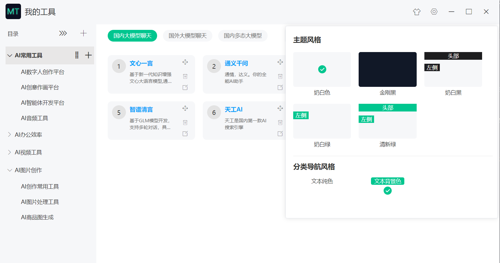

# 功能简明

  可本地化管理和可视化创建自己的网址分类
  安装后有默认的数据，可删除、修改

## 一、左侧菜单功能说明

- 左侧一级目录和二级菜单管理功能，可以新增、重命名、删除目录和菜单
- 左侧一级目录同级拖拽排序的功能
- 左侧二级菜单同级拖拽排序的功能
- 左侧二级菜单可以移动到其他目录
- 点击一级目录也可以跳转右侧列表，并且可以创建分类和新增网址

## 二、右侧网址列表功能说明

- 右键导航分类可以删除和重命名导航分类名称
- 点击分类右侧的加号按钮可以新增分类
- 点击列表加号按钮可以新增网址
- 在网址模块右侧的地方拖拽可以进行实时排序
- 每个分类的网址都可以删除、编辑
- 右键网址描述的地方出现复制到其他分类的功能

## 三、主题选择切换

* 点击右上角主题图标，可以选择切换主题风格

   
## 四、设置功能

* 设置里可以查看数据存储的位置，方便数据迁移时使用
* 设置里可以手动备份数据

## 五、产品图片

